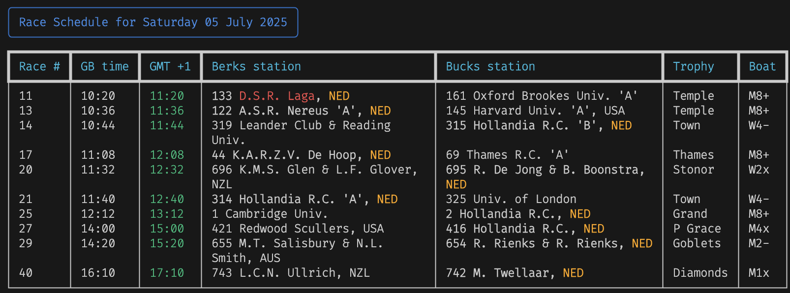

# Henley Royal Regatta - Daily Race Schedule

The Henley Royal Regatta is one of the most prestigious races in rowing. A lot of crews compete and it can be hard to keep track of your favorite team.
This script fetches and displays the race timetable for the Henley Royal Regatta. It allows users to search for specific crews and displays the race schedule in both GB and local times based on the specified GMT offset. Run this script after the draw is published to get the latest results.

## Installation

```
pip3 install uv
uv venv
source .venv/bin/activate # on MAC
```

## Usage

```
uv run main.py [--crew <search_string1> <search_string2> ...] [--gmt <offset>] [--boat <boat_type>] [--trophy <trophy_name>] [--offline] [--notify] [--save-config]
```

When there is no race schedule on the Henley Site, you have to wait for the next edition.

### Arguments

- `--crew`: List of substrings that should be matched with the name of the crews. Can be country code (_NED_) for Non-UK contenders, the number of the crew (_123_) or every crew from one particular club (_'Thames R.C.'_ or _Brookes_) separated by spaces (case insensitive)
- `--gmt`: GMT offset for local time display (default: 1 for NL time)
- `--boat`: Filter races by boat type (e.g., M8+, W4x)
- `--trophy`: Filter races by trophy name (e.g., Temple, Diamonds)
- Without arguments, the whole schedule is shown.

### Examples

Example to show the schedule for Dutch Crews, crew 123 and every crew from Oxford Brookes in Houston, USA:

```
uv run main.py --crew NED 123 'Oxford brookes' --gmt -6
```

Example to filter races by boat type (Men's Eight) and save these settings:

```
uv run main.py --boat M8+
```

Example to show only Diamond Sculls races:

```
uv run main.py --trophy Diamonds
```

## Features

- **Rich Text Interface**: Beautiful formatted tables with colors and styling
- **Customizable Filtering**: Filter races by crew, boat type, or trophy
- **Local Time Conversion**: Automatically converts race times to your local timezone
- **Offline Mode**: Cache race data for offline viewing
- **Notifications**: Alerts for upcoming races
- **Configuration System**: Save your preferences for future use
- **Progress Indicators**: Visual feedback during data loading

## Example Output:



## Rights

All rights to the race schedule data are owned by the Henley Royal Regatta. The data is fetched from the official [Henley Royal Regatta Race TimeTable](https://www.hrr.co.uk/2024-competition/race-timetable/)

```

```
